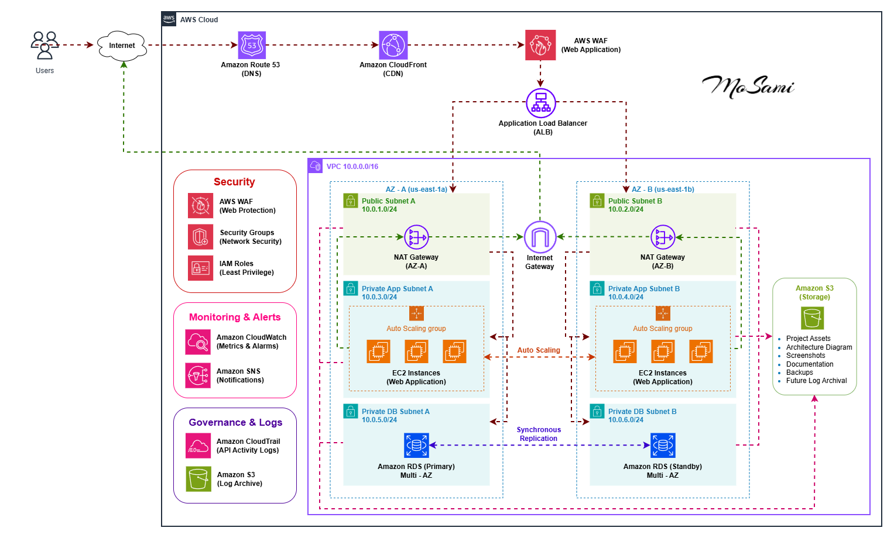

# AWS Production-Ready Highly Available Web Application

## Project Overview

This project demonstrates the design and implementation of a production-ready, highly available, and secure web application architecture on AWS.

The infrastructure follows AWS Well-Architected Framework best practices, including high availability, scalability, security, monitoring, and fault tolerance.

The application is deployed across multiple Availability Zones using Amazon EC2 instances managed by an Auto Scaling Group behind an Application Load Balancer. Security is enhanced using AWS WAF, private subnets, Security Groups, and IAM roles. Monitoring and alerting are implemented using Amazon CloudWatch and SNS.

---

# Architecture Diagram



---

# Solution Architecture

The infrastructure is deployed inside a custom VPC and spans two Availability Zones to achieve fault tolerance and high availability.

Users access the application through an Application Load Balancer.

The Load Balancer distributes traffic across multiple EC2 instances deployed in private subnets.

Auto Scaling automatically launches or terminates EC2 instances based on demand.

Amazon RDS provides managed database services.

Amazon S3 provides centralized object storage for project assets, backups, screenshots, and documentation.

AWS WAF protects the application against common web exploits including:

- SQL Injection
- Cross Site Scripting (XSS)
- Known Malicious Inputs
- Bad Reputation IP Addresses

CloudWatch monitors infrastructure metrics and SNS sends notifications when alarms are triggered.

---

# AWS Services Used

## Networking

- Amazon VPC
- Public Subnets
- Private Application Subnets
- Private Database Subnets
- Internet Gateway
- NAT Gateway
- Route Tables

## Compute

- Amazon EC2
- Launch Template
- Auto Scaling Group

## Load Balancing

- Application Load Balancer
- Target Groups
- Health Checks

## Database

- Amazon RDS MySQL

## Storage

- Amazon S3

## Security

- AWS WAF
- Security Groups
- IAM Roles
- Systems Manager Session Manager

## Monitoring

- Amazon CloudWatch
- Amazon SNS

---

# VPC Design

## VPC

```text
CIDR: 10.0.0.0/16
```

---

## Public Subnets

### Public Subnet A

```text
10.0.1.0/24
AZ-A
```

### Public Subnet B

```text
10.0.2.0/24
AZ-B
```

Used for:

- Application Load Balancer
- NAT Gateways

---

## Private Application Subnets

### Private-App-A

```text
10.0.11.0/24
AZ-A
```

### Private-App-B

```text
10.0.12.0/24
AZ-B
```

Used for:

- EC2 Instances

---

## Private Database Subnets

### Private-DB-A

```text
10.0.21.0/24
AZ-A
```

### Private-DB-B

```text
10.0.22.0/24
AZ-B
```

Used for:

- Amazon RDS

---

# Security Groups

## ALB Security Group

Inbound Rules

```text
HTTP 80     0.0.0.0/0
HTTPS 443   0.0.0.0/0
```

Outbound Rules

```text
All Traffic
```

---

## EC2 Security Group

Inbound Rules

```text
HTTP 80
Source: ALB Security Group
```

Outbound Rules

```text
All Traffic
```

---

## RDS Security Group

Inbound Rules

```text
MySQL 3306
Source: EC2 Security Group
```

Outbound Rules

```text
All Traffic
```

---

# Auto Scaling Configuration

Minimum Capacity

```text
2
```

Desired Capacity

```text
2
```

Maximum Capacity

```text
4
```

Scaling Metric

```text
CPUUtilization
```

Scale-Out Trigger

```text
CPU > 70%
```

Scale-In Trigger

```text
CPU < 30%
```

---

# Application Load Balancer

Features:

- Multi-AZ Deployment
- Health Checks
- Traffic Distribution
- Fault Tolerance

Health Check Path

```text
/
```

Protocol

```text
HTTP
```

Port

```text
80
```

---

# Amazon RDS

Database Engine

```text
MySQL
```

Deployment

```text
Multi-AZ
```

Database Subnets

```text
Private-DB-A
Private-DB-B
```

Accessibility

```text
Private
```

Public Access

```text
Disabled
```

Features

- Multi-AZ High Availability
- Automatic Failover
- Managed Backups
- Private Network Access

## RDS Validation

- Verified Multi-AZ deployment status
- Verified database availability
- Verified private access through Security Groups
- Verified successful application connectivity from EC2 instances

Result:

```text
Status: Available
Deployment: Multi-AZ
Public Access: Disabled
```

---

# Amazon S3

Used For:

- Project Assets
- Architecture Diagram
- Screenshots
- Documentation
- Backups
- Future Log Archival

Features Enabled:

- Versioning
- Server-Side Encryption

---

# AWS WAF Configuration

The following managed rule groups were enabled:

### Core Rule Set

Protects against:

- XSS
- Common Web Exploits
- OWASP Top 10

### Known Bad Inputs

Protects against:

- Malicious Requests
- Suspicious Payloads

### SQL Database Protection

Protects against:

- SQL Injection Attacks

### Amazon IP Reputation List

Blocks:

- Known Malicious IP Addresses

---

# Monitoring and Alerting

Amazon CloudWatch was configured to monitor:

- EC2 CPU Utilization
- Auto Scaling Activities
- Load Balancer Metrics

Alarm:

```text
High CPU Utilization
```

Notification Service:

```text
Amazon SNS
```

Email notifications are automatically sent when alarms are triggered.

---

# High Availability Features

- Multi-AZ Application Deployment
- Multi-AZ Amazon RDS
- Application Load Balancer
- Auto Scaling Group
- Health Checks
- Self-Healing Infrastructure
- Redundant NAT Gateways
- Automatic Database Failover

---

# Security Features

- Private Application Subnets
- Private Database Subnets
- Security Groups
- AWS WAF
- IAM Roles
- Session Manager
- S3 Encryption
- RDS Private Access

---

# Testing Performed

### Load Balancer Validation

Verified successful access through ALB DNS endpoint.

### Auto Scaling Validation

Verified Auto Scaling Group automatically maintains desired capacity.

### Health Check Validation

Verified healthy targets in Target Group.

### WAF Validation

Verified protection against malicious requests and web attacks.

### RDS Connectivity Validation

Verified database deployment and availability.

### Application Validation

Verified successful connectivity between EC2 instances and Amazon RDS MySQL database.

---

# Learning Outcomes

Through this project I learned how to:

- Design a production-ready AWS architecture
- Build highly available applications
- Configure Auto Scaling Groups
- Deploy and manage Application Load Balancers
- Secure applications using AWS WAF
- Implement VPC networking and subnetting
- Configure Amazon RDS securely
- Monitor AWS resources using CloudWatch
- Implement notifications using SNS
- Follow AWS Well-Architected Framework best practices

---

# Future Enhancements

The following AWS services can be integrated in future versions of the project:

- Amazon Route 53 for custom domain management and DNS routing
- Amazon CloudFront for global content delivery and caching
- AWS Certificate Manager (ACM) for HTTPS/TLS certificates
- CloudWatch Logs export to Amazon S3 for long-term log retention
- Infrastructure as Code (IaC) using AWS CloudFormation or Terraform

---

# Project Author

Mohamed Sami

AWS Solutions Architect Associate Capstone Project
